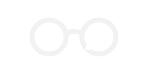

<h1 align="center"> Guia Anônima </h1>

    
     
    

    Guia Anônima é uma comunidade de Segunrança da Informação.
     
    Nós visamos o compartilhamento de conhecimento, independente do nível.
     

    
    
    
    
    
    

